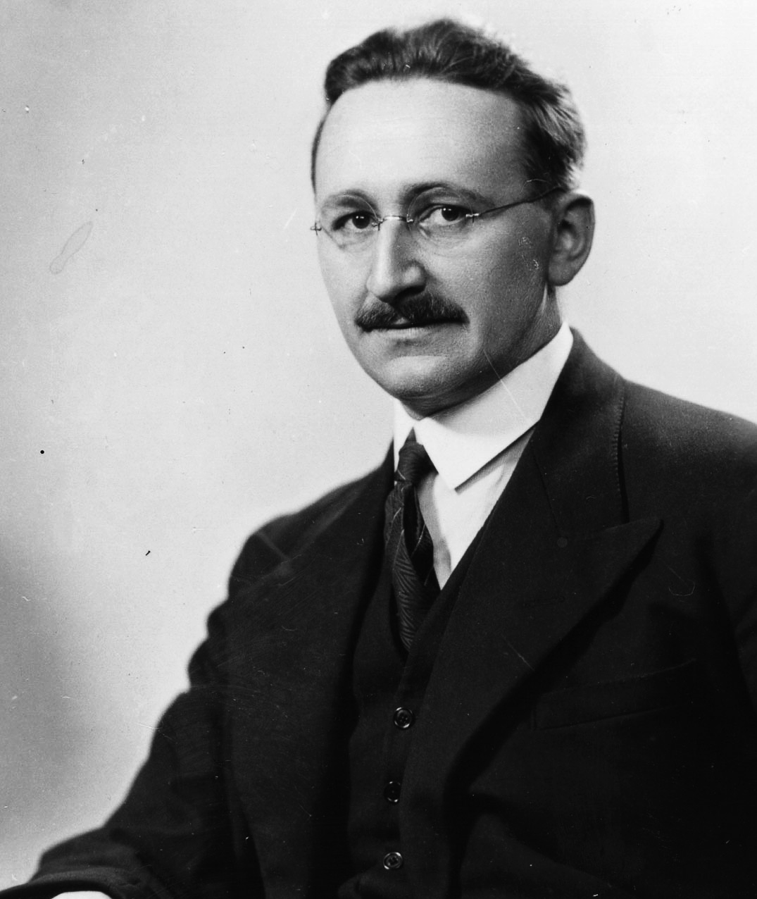

(chap:book)=
# Risk, Ambiguity, and Misspecification[^footnote1]

[^footnote1]: This chapter draws heavily on a paper with the same title that was recently published in the *Journal of Applied Econometrics*.

**Lars Peter Hansen**[^HansenFootnote], **Thomas J. Sargent**[^SargentFootnote]

[^HansenFootnote]: University of Chicago. Email: lhansen@uchicago.edu
[^SargentFootnote]: New York University. Email: thomas.sargent@nyu.edu

Related papers: 
1. [Hansen and Sargent (2021a)](https://www.sciencedirect.com/science/article/pii/S0022053120301587): Structured Ambiguity and Model Misspecification 
2. [Hansen and Sargent (2021b)](https://www.sciencedirect.com/science/article/pii/S0304407620303419): Macroeconomic Uncertainty Prices when Beliefs are Tenuous 
3. [Hansen (2007)](https://www.aeaweb.org/articles?id=10.1257/aer.97.2.1): Beliefs, Doubts and Learning: Valuing Macroeconomic Risk 

---

## Abstract

What are "deep uncertainties" and how should their presence influence prudent decisions? To address these questions, we bring ideas from robust control theory into statistical decision theory. Decision theory has its origins in axiomatic formulations by von Neumann and Morgenstern, Wald, and Savage. After Savage, decision theorists constructed axioms that formalize a notion of ambiguity aversion. Meanwhile, control theorists constructed decision rules that are robust to some model misspecifications. We reinterpret axiomatic foundations of decision theories to express ambiguity about a prior over a family of models along with concerns about misspecifications of the corresponding likelihood functions. 


(sec:intro)=

## Introduction

Climate scientists confront "deep uncertainties."[^deep_uncertainties] Practicing econometricians also often struggle with uncertainty about their statistical models, but usually with scant guidance from significant advances in decision theory made after {cite}`wald1947essentially,wald1949statistical,Wald_statist_dec_book`, {cite}`Savage:1954`, and {cite}`ellsberg1961risk` because so much recent formal theory of decision making under uncertainty in economics is not cast explicitly in terms of the likelihoods and priors that are the foundations of statistics and econometrics.[^econometricians_uncertainty] Likelihoods are probability distributions conditioned on parameters while priors describe a decision maker's subjective belief about parameters.[^likelihoods_priors] By distinguishing roles played by likelihood functions and subjective priors over parameters, this paper aims to bring contributions to decision theory after Wald and Savage into closer contact with statistics and econometrics in ways that can address practical econometric concerns about model misspecifications and selections of prior probabilities.

[^deep_uncertainties]: Deep uncertainties are defined and discussed by {cite}`hallegatte2012investment`, {cite}`maier2016uncertain`, {cite}`marchau2019decision`, and {cite}`rising2022missing`.

[^econometricians_uncertainty]: Econometricians who explicitly confronted model uncertainty include {cite}`onatski2002robust`, {cite}`brock2003west`, {cite}`stock2006forecasting`, {cite}`brock2007model`, {cite}`del2009monetary`, {cite}`christensen2018dynamic`, {cite}`christensen2019counterfactual`, {cite}`christensen2020robust`, {cite}`andrews2021model`, and {cite}`bonhomme2018minimizing`. {cite}`Chamberlain_2000,Chamberlain_2001` and {cite}`Ho:2023` used a post Wald-Savage decision theory of {cite}`GilboaSchmeidler:1989` to confront model uncertainty in his econometric work.

[^likelihoods_priors]: The term likelihood can have multiple meanings. We shall use it to represent a probability density of prize-relevant outcomes, which we refer to as repercussions, conditioned on parameters. Distinguishing likelihood functions from subjective priors is fundamental to Bayesian formulations of statistical learning. See {cite}`definetti`, who recommended exchangeability as a more suitable assumption than iid (independent and identically distributed) to model situations in which a decision maker wants to learn. Putting subjective probabilities over parameters that index likelihood functions for iid sequences of random vectors generates exchangeable sequences of random variables.

Although they proceeded differently than we do, {cite}`Chamberlain:2020`, {cite}`Cerreiaetal:2013`, and {cite}`denti2022model` studied related issues. {cite}`Chamberlain:2020` emphasized that likelihoods and priors are both vulnerable to potential misspecifications. His ultimate focus was on uncertainty about predictive distributions that are constructed by integrating likelihoods with respect to priors. Our paper instead formulates a decision theory with distinct uncertainties about priors and likelihoods. {cite}`Cerreiaetal:2013` (section 4.2) provide a rationalization of the smooth ambiguity preferences proposed by {cite}`KlibanoffMarinacciMukerji:2005` that includes likelihoods and priors as components. {cite}`denti2022model` extend this approach by using an axiomatic revealed preference approach to deduce an implied parameterization of a likelihood function. But neither of those papers sharply distinguishes prior uncertainty from concerns about possible model misspecifications, something that we want to do. We formulate concerns about model misspecifications as uncertainty about likelihoods.

We assemble concepts and practical ways of modeling risks and concerns about model misspecifications from statistics, robust control theory, economics, and decision theory. We align definitions of statistical models, uncertainty, and ambiguity with ideas from decision theories that build on {cite}`Anscombe_Aumann`'s way of representing subjective and objective uncertainties. We connect our analysis to econometrics and robust control theory by using Anscombe-Aumann states as *parameters* that index alternative statistical models of random variables that affect outcomes that a decision maker cares about. By modifying {cite}`Gilboaetal:2010`, {cite}`Cerreiaetal:2013`, and {cite}`denti2022model`, we show how to use variational preferences to represent uncertainty about priors and concerns about statistical model misspecifications.

Some "behavioral" models in economics and finance assume expected utility preferences in which an agent's subjective probability differs systematically from probabilities that govern the data.[^behavioral_models] This literature also contains discussions of differences among agents in their confidence in their view of the world. Lack of confidence can take different forms under different notions of uncertainty. Preference structures that we describe in this paper allow us to formalize different degrees of "confidence" both about details of specifications of particular statistical models and about subjective probabilities to attach to alternative statistical models. Our representations of preferences provide ways to characterize degrees of confidence in terms of perceived statistical plausibilities.[^confidence_psychology] 

[^behavioral_models]: We put "behavioral" in quotes to emphasize that most economic models are about agents' behaviors, including models that impose the rational expectations and common knowledge assumptions that "behavioral" economists want to drop. "Behavioral" economics sometimes means work that is linked more or less informally to psychology.

[^confidence_psychology]: Although we provide no formal links to psychology here, we think that a promising research plan would explore connections between so-called behavior distortions and the inferential challenges that economic decision makers confront. As is often assumed in behavioral models, degrees of confidence could differ across economic agents.


## Background motivation

### Climate change and "deep uncertainty"

> "The economic consequences of many of the complex
risks associated with climate change cannot, however, currently be quantified. ... these unquantified, poorly understood and often deeply uncertain risks
can and should be included in economic evaluations and decision-making processes." {cite}`rising2022missing`

### Hayek's haunting forewarning

%

> "Even if true scientists should recognize the limits of studying human behavior, as long as the **public has expectations**, there will be people who **pretend** or **believe** that they can do more to meet popular demand than what is really in their power."
> From Hayek's Nobel address (1974)
## Uncertainty tradeoffs

- How much weight do we assign to: 

  - best guesses

  - potentially bad outcomes

  when making decisions?

- Do we *act now*, or do we *wait* until we learn more?
## Aims

Aims include allowing a broad perspective on uncertainty, encompassing:
- Risk: Unknown outcomes with known probabilities.
- Ambiguity: Unknown weights to assign to alternative probability models.
- Misspecification: Unknown ways in which a model might provide flawed probabilistic predictions.

Furthermore, the aims emphasize the inclusion of formulations that are dynamic and recursive.

### Statisticians' perspective on model misspecification

> "Since all models are wrong, the scientist must be alert to what is importantly wrong. It is inappropriate to be concerned about mice when there are tigers abroad." - Box (1976).

> "... it does not seem helpful just to say that all models are wrong. The very word 'model' implies simplification and idealization. The idea that complex physical, biological or sociological systems can be exactly described by a few formulae is patently absurd. The construction of idealized representations that capture important stable aspects of such systems is, however, a vital part of general scientific analysis and statistical models, especially substantive ones ..." - Cox (1995).

### Decision theory overview

This section provides:
- Axiomatic formulations of "rationality" in the presence of uncertainty, broadly conceived.
- Tractable ways to capture alternative uncertainty components in dynamic environments.

### Approach

The approach involves drawing on and developing modifications of Savage-style axiomatic formulations from decision theory to extend notions of uncertainty beyond risk. This aims to make contact with applied challenges in economics and other disciplines. It also distinguishes concerns about potential misspecifications of likelihoods from concerns about the misspecification of priors.

This opens the door to better ways for conducting uncertainty quantification for dynamic, stochastic economic models used for private sector planning and governmental policy assessment. Achieved by providing tractable and revealing methods for exploring subjective uncertainty, including potential model misspecification and ambiguity across models.

Goals include:
- Assess the impact of uncertainty on prudent decision or policy outcomes.
- Isolate the forms of uncertainty that are most consequential for these outcomes.

Inputs entail:
- Utilizing tools from probability and statistics to limit the type and amount of uncertainty that is entertained.
- Aversion to or dislike of uncertainty about probabilities over future events.
## Anscombe-Aumann (AA)

### Preferences defined over acts

- **act**: maps states $ \rightarrow$ probabilities over outcomes

AA contrast a horse race and a lottery for motivation.

- The probability distribution over outcomes is the "lottery."
- The probability over states is the "horse race."

Consider a parameterized model of a random vector with realization $w$:
```{math}
\ell(w | \theta) d \tau_o(w) 
```
where
```{math}
\int_W \ell(w | \theta) d \tau_o(w) = 1,
```
$\theta \in \Theta$ and $\Theta$ is a parameter space, and $W$ is the space of possible realizations of $w$. We refer to $\ell$ as a likelihood and the probability implied by each $\theta$ as a "structured" probability model.

Place a baseline prior distribution $\pi_o$ over $\Theta$ and consider a "prize rule"  $\delta(w)$.

(sub-ex)=
### Example

- Decision maker presumes a family of densities $\ell(w | \theta)$ whose realizations are denoted by $w$'s, and where $\theta$ is an unknown parameter vector
- A statistical experiment gives an observation of a random vector $y = \zeta(w)$ that contains information about $w$ (signals).
- A decision $\delta$ is a (measurable function) that maps observations $y$ from the statistical experiment into a set of **actions**.
- Potential actions constrain a prize rule $\gamma_\delta$ to satisfy:  
```{math}
\gamma_\delta(w) = \Psi[ \delta \circ \zeta (w), w ] .
```

Since the prize rule can depend on information about the future shocks, **ex post** learning is entertained. The preferences imply a ranking over $\delta$'s.

(sub-approachI)=
### Approach I

Focus on a single likelihood function, but entertain multiple prior distributions. For instance, let $n(\theta)$'s that satisfy:
```{math}
\int_\Theta n(\theta) d \pi(\theta) = 1
```
Use $n$'s to denote alternative prior distributions of the form $ n(\theta) d \pi(\theta)$.  

- A **state** is a **parameter vector**, $\theta,$ that indexes a statistical model.
- Each **statistical model** induces a probability distribution over outcomes.
- A probability distribution over states is a **prior** distribution.
- The family of $n$'s give alternative prior distributions over $\Theta$.

Ambiguity aversion in the decision theory literature becomes tied to prior uncertainty with links to robust Bayesian methods. Misspecification pertains only to a baseline prior.

(sub-approachII)=
### Approach II

Focus on a single model, a single value of $\theta$. Let
```{math}
\ell(w | \theta)d \tau(w) 
```
be a baseline distribution over $W$. Let 
```{math}
m(w | \theta)\ell(w | \theta) d \tau(\theta)
```
denote an alternative distribution over $W$ where 
```{math}
\int m(w | \theta)\ell(w | \theta) d \tau(\theta) = 1.
```
We use $m$'s to represent potential misspecifications of the baseline probability model. We refer to the $m$'s as "unstructured" probability models.

- A **state** is a potential realization $w$
- The family of $m(\cdot | \theta)$'s give alternative probability distributions over $W$

This formulation allows us to explore potential model misspecification without imposing priors over unstructured models. This formulation has direct ties to robust control theory. Misspecification refers only the likelihood function. Lotteries are used as i) a way to contrast risk from uncertainty and ii) to convexify the family of decisions.

### Representations of preferences

#### Subjective expected utility

Order preferences over $\gamma$ by
```{math}
\int_\Theta \left[ \int_{W} u[\gamma(w)] \ell(w | \theta) d \tau_o(w)  \right] d\pi_o(\theta).
```
Supported by Savage and AA axioms, but **no misspecification** of priors or likelihoods. Best connected to Approach I.

> ... if I knew of any good way to make a mathematical model of these phenomena [vagueness and indecision], I would adopt it, but I despair of finding one. One of the consequences of vagueness is that we are able to elicit precise probabilities by self-interrogation in some situations but not in others.

Personal communication from L. J. Savage to Karl Popper in 1957

#### Divergences

Use a convex function $\phi$ for constructing divergence between probability measures. Each $\phi$ is a **convex** function with $\phi(1) = 0$ and $\phi''(1) = 1$ (normalization).

- Consider alternative priors of the form $d \pi(\theta) = n(\theta) d\pi_o(\theta)$ for $n \ge 0$ satisfying:
```{math}
\int_{\Theta} n(\theta) d\pi_o(\theta) = 1.
```
Call this collection ${\mathcal N}.$

- For priors indexed by $n \in {\mathcal N}$, form
```{math}
\int_\Theta \phi [n(\theta)] d \pi_o(\theta) \ge 0.
```

- $\phi(n) = n \log n$ is an "interesting" example. Called a **Kullback-Leibler divergence** or **relative entropy**.

- Use an analogous approach for likelihoods with a divergence over $m(w | \theta)$ for a given $\theta$.

#### Using ambiguity aversion to represent robust Bayesian preferences

- **variational preferences** (Maccheroni, Marinacci, and Rustichini, 2006)
```{math}
\min_{n \in {\mathcal N} }  \int_\Theta  \left( \int_W u[\gamma(w)] \ell(w | \theta )  d \tau_o(w) \right) n(\theta) d\pi_o(\theta)  
 + \xi_1\int_\Theta  \phi_1[n(\theta)] d \pi_o(\theta)  
```
for $\xi_1 > 0$ and a convex function $\phi_1$ such that $\phi_1(1) = 0$ where the penalty parameter $\xi_1$ reflects ambiguity aversion. Note an arbitrarily **large** $\xi_1$ approximates subjective expected utility.

or

- **max-min utility** (Gilboa and Schmeidler, 1989)
```{math}
\min_{n \in {\mathcal N}^o }  \int_\Theta  \left( \int_W u[\gamma(w)] \ell(w | \theta )  d \tau_o(w) \right) n(\theta) d\pi_o(\theta)  
```
for ${\mathcal N}^o \subset {\mathcal N}$ where the specification of ${\mathcal N}_o$ reflects ambiguity aversion.


````{prf:example}
:label: Relative entropy divergence

Note that $n \log n$ is convex in $n$ equal to zero and $n=1$ with a second derivative that is one at $n=1$.  
Define 
```{math}
{\overline U}(\theta) = \int_W u[\gamma(w)] \ell(w\mid \theta )  d \tau_o(w) 
```
Solve the Lagrangian:
```{math}
\min_n \int_\Theta {\overline U}(\theta) n(\theta) d \pi_o(\theta)  + \xi_1 \int_\Theta \log n(\theta) n(\theta) d\pi_o(\theta) + \lambda \int_\Theta[n(\theta) -1] d \pi_o(\theta)
```
This problem separates in terms of the choice of $n(\theta)$, and can be solved $\theta$ by $\theta$.
The first-order conditions are:
```{math}
{\overline U}(\theta) + \xi_1 + \xi_1 \log n(\theta) + \lambda = 0.
```
Solving for $\log n(\theta)$:
```{math} 
\log n(\theta) = -  \frac 1 {\xi_1} {\overline U}(\theta) - 1 - \frac {\lambda}{\xi_1}
```
Thus 
```{math}
n(\theta) \hspace{.2cm} \propto \hspace{.2cm} \exp\left[ - \frac 1 {\xi_1} {\overline U}(\theta) \right].
```
Imposing the integral constraint on $n$ gives the solution:
```{math}
n^*(\theta) = \frac {\exp\left[ - \frac 1 {\xi_1} {\overline U}(\theta) \right]}{\int_\Theta \exp\left[ - \frac 1 {\xi_1} {\overline U}(\theta) \right] d \pi_o(\theta)} 
```
;provided that the denominator is finite. This solution is induces what is known as exponential tilting. The baseline probabilities are tilted towards lower values of ${\overline U}(\theta)$. Plugging back into the minimization problem gives:
```{math}
- \xi_1 \log \int_\Theta \exp\left[ - \frac 1 {\xi_1} {\overline U}(\theta) \right] d \pi_o(\theta). 
```
This minimized objective is known to depict be a special case of "smooth ambiguity" preferences initially proposed by {cite}`KlibanoffMarinacciMukerji:2005`.    
````


### Using ambiguity aversion to represent preferences with model misspecification concerns


- Replace $l(w \mid \theta) d \tau_o(w) $ with $m(w \mid \theta) \ell(w \mid \theta) d \tau_o(w) $ for $m$ satisfying:
$\int_W m(w \mid \theta) \ell(w \mid \theta) d\tau_o(w)  = 1$, and denote the set of all such $m's$ as $\mathcal M$.  

- Rank alternative $\gamma$'s conditioned on $\theta$ by solving: 
```{math}
\min_{m \in {\mathcal M}}   \int_W \left( u[\gamma(w)]m(w \mid \theta) +  \xi_2 \phi_2[m(w \mid \theta) ]\right) \ell(w \mid \theta) d\tau_o(w) 
```
for $\xi_2 > 0$ and $\phi_2$ is a convex function satisfying $\phi_2(1) = 1$ where $\xi_2$ is a penalty parameter that reflects aversion to misspecification.    

Observations:

- We do *not* impose a prior distribution over `${\mathcal M}$ (conditioned on $\theta$). 

- This approach has links to parts of *robust control theory*.


Combining concerns for likelihood and prior misspecification pushes the decision problem outside the AA framework.
## Opening the door to likelihood and prior robustness

Use the AA framework to address model misspecification by entertaining *unstructured alternatives*. Add a set $Q$ of *structured probability models* to the AA framework along with a two-preference framework proposed by {cite}`Gilboaetal:2010`.

- "mental preferences" are a partial ordering induced by *unanimity* over all *structured models* (familiar from treatments of admissibility in statistical decision theory).

- Allow the mental preferences incorporate model misspecification concerns.

- Introduce "behavioral preferences" are *complete*, used in actual decision making and entertain *ambiguity* over structured probability models.

* Axiomatic inputs provide links between these two preferences.

### Robust Bayes with model misspecification, I

*Represent preferences* over $\gamma$ using:

```{math} 
\begin{aligned}
\min_{n \in {\mathcal N}^o } \min_{m \in {\mathcal M}}  & \int_\Theta  \left( \int_W u[\gamma(w)] m(w \mid \theta) \ell(w\mid \theta ) d \tau_o(w) \right) n(\theta) d\pi_o (\theta)  \\ 
& + \xi_2\int_\Theta  \left( \int_W  \phi_2[m(w \mid \theta)]  \ell(w \mid \theta) d\tau_o(w)  \right) d \pi(\theta) 
\end{aligned}
```

### Robust Bayes with model misspecification, II

*Represent preferences* over $\gamma$ with:
```{math}
\begin{aligned}
\min_{n \in {\mathcal N} } \min_{m \in {\mathcal M}}  & \int_\Theta  
\left( 
\int_W u[\gamma(w)] m(w \mid \theta) \ell(w\mid \theta )  d \tau_o(w) \right) n(\theta) d\pi_o (\theta)  \\ 
& + \xi_2\int_\Theta  \left( \int_W \phi_2[m(w \mid \theta)]  \ell(w \mid \theta) d\tau_o(w)  \right) n(\theta) d \pi_o(\theta) \\ 
& + \xi_1 \int_\Theta \phi_1[n(\theta)] d\pi_o(\theta) 
\end{aligned}
```

Note: This approach uses a *joint divergence* over $(m,n)$.
